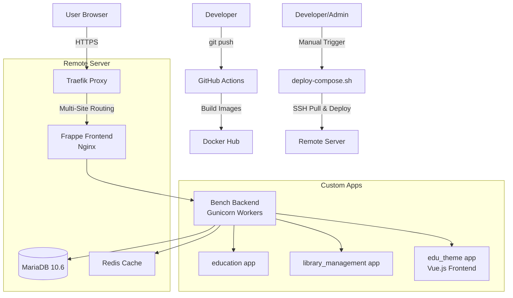

# frappe_docker Project Manual

> **"Drivers Manual"** for the OpenAgile ERPNext multi-site deployment  
> Last Updated: 2026-01-28  
> Parent Doc: [`../DOCUMENTATION_INDEX.md`](file:///home/zubbyik/dev/obsidan_global/docker_compose_projects/openagile/DOCUMENTATION_INDEX.md)

---

## Project Overview

**frappe_docker** is a production-ready ERPNext deployment with custom applications:
- **Framework**: Frappe Framework v15
- **ERP Suite**: ERPNext v15
- **Custom Apps**: education, library_management, edu_theme (Vue.js 3 frontend)
- **Deployment**: `deploy-compose.sh` script (manual trigger)
- **Infrastructure**: Integrated with OpenAgile Traefik stack

**Live Sites**:
- Main ERPNext: `https://erpnext.zubbystudio.shop`
- Library Management: `https://library.erpnext.zubbystudio.shop`
- Education Portal: `https://edu.erpnext.zubbystudio.shop`
- Landing Page (Vue.js): `https://edu.erpnext.zubbystudio.shop/landing`

---

## Architecture



---

## Development Workflow

### 🛠️ Local Development

> [!IMPORTANT]
> This is a **local workstation**. Docker containers run ONLY on the remote server.

**Custom App Development**:
```bash
# Edit app code locally
cd apps/edu_theme
vim edu_theme/www/landing.html

# Edit Vue.js frontend
cd apps/edu_theme/frontend
npm run dev  # Local Vite dev server
```

**Vue.js Frontend (edu_theme)**:
```bash
cd apps/edu_theme/frontend

# Install dependencies
npm install

# Development server
npm run dev  # Opens http://localhost:5173

# Build for production
npm run build  # Outputs to ../edu_theme/public/frontend
```

### 🚀 Deployment Workflow

> [!CAUTION]
> **Deployment is MANUAL via `deploy-compose.sh` script.** No automatic GitHub Actions deployment.

**Deployment Process**:
```bash
# 1. Make changes locally (app code, Docker configs)
git add apps/ compose.yaml overrides/
git commit -m \"feat: description of changes\"

# 2. Push to GitHub
git push origin main

# 3. SSH to server and run deployment script
ssh zubbyik@185.216.177.250
cd /home/zubbyik/openagile/frappe_docker
git pull origin main
./deploy-compose.sh
```

**What `deploy-compose.sh` Does**:
1. Stops existing containers
2. Starts services with all overrides
3. Builds Vue.js frontend assets (edu_theme)
4. Installs custom apps into Python environment
5. Runs `bench build` to generate assets
6. Clears cache for all sites
7. Performs health checks

---

## Tech Stack

### Frappe/ERPNext
- **Frappe Framework**: v15.90.1
- **ERPNext**: v15.90.1
- **Python**: 3.11
- **Node.js**: 18

### Custom Apps
- **education**: v15.0.0 (Frappe official app)
- **library_management**: v0.0.1 (custom)
- **edu_theme**: v0.0.1 (custom, Vue.js 3 frontend)

### Infrastructure
- **Database**: MariaDB 10.6
- **Cache**: Redis
- **Web Server**: Nginx (frontend container)
- **App Server**: Gunicorn (backend container)
- **Reverse Proxy**: Traefik (Cloudflare SSL)
- **Network**: `openagile_openagile_network`

---

## Infrastructure Contract

This project MUST follow patterns from [`../INFRASTRUCTURE_CONTRACT.md`](file:///home/zubbyik/dev/obsidan_global/docker_compose_projects/openagile/INFRASTRUCTURE_CONTRACT.md):

### Required Traefik Labels (from overrides/compose.external-traefik.yaml)
```yaml
labels:
  - \"traefik.enable=true\"
  - \"traefik.docker.network=openagile_openagile_network\"  # CRITICAL
  - \"traefik.http.routers.erpnext.rule=Host(`erpnext.zubbystudio.shop`)\"
  - \"traefik.http.routers.erpnext.entrypoints=websecure\"
  - \"traefik.http.routers.erpnext.tls.certresolver=cloudflare\"
  - \"traefik.http.services.erpnext-frontend.loadbalancer.server.port=8080\"
```

### Custom App Installation Pattern
```bash
# Apps MUST be installed in bench's Python environment
docker compose exec backend /home/frappe/frappe-bench/env/bin/pip install -e apps/<app_name>
```

---

## File Structure

```
frappe_docker/
├── compose.yaml                          # Base services (backend, frontend, scheduler, worker)
├── deploy-compose.sh                     # Master deployment script
├── overrides/
│   ├── compose.databases.yaml           # MariaDB + Redis
│   ├── compose.external-traefik.yaml    # Traefik integration
│   ├── compose.persist-apps.yaml        # Volume mounts for apps
│   └── compose.frontend-custom-apps.yaml # Asset symlink bypass
├── apps/
│   ├── edu_theme/                       # Vue.js 3 custom app
│   ├── education/                       # Education app
│   └── library_management/              # Library app
├── sites/
│   ├── apps.txt                         # List of installed apps
│   ├── erpnext.zubbystudio.shop/        # Site 1
│   ├── library.erpnext.zubbystudio.shop/ # Site 2
│   └── edu.erpnext.zubbystudio.shop/    # Site 3 (with Vue landing page)
├── docs/
│   └── custom_app_deployment_troubleshooting.md
└── .github/workflows/                   # Docker image builds only
```

---

## Custom App: edu_theme

**Vue.js 3 Frontend Integration**

### Features
- **Landing Page**: `/landing` route with dynamic content
- **API Integration**: Consumes `get_landing_page_data` from Frappe backend
- **Build System**: Vite
- **Component Library**: Headless UI, Heroicons

### Development Workflow
```bash
cd apps/edu_theme/frontend

# Install dependencies
npm install

# Development server
npm run dev

# Build for production
npm run build
```

### API Endpoint
**Backend**: `apps/edu_theme/edu_theme/api.py`
```python
@frappe.whitelist(allow_guest=True)
def get_landing_page_data():
    return {
        \"hero\": {...},
        \"courses\": [...]
    }
```

**Frontend**: Fetches data via `fetch('/api/method/edu_theme.api.get_landing_page_data')`

---

## Common Tasks

### Run Deployment Script
```bash
ssh zubbyik@185.216.177.250
cd /home/zubbyik/openagile/frappe_docker
./deploy-compose.sh
```

### View Logs
```bash
docker compose logs -f backend
docker compose logs -f frontend
```

### Access Bench Console
```bash
docker compose exec backend bench console
```

### Clear Cache (All Sites)
```bash
docker compose exec backend bench --site all clear-cache
```

### Rebuild Assets
```bash
docker compose exec backend bench build --force
```

### Install New App
```bash
# 1. Add app to apps.txt
echo \"new_app\" >> sites/apps.txt

# 2. Install in Python environment
docker compose exec backend /home/frappe/frappe-bench/env/bin/pip install -e apps/new_app

# 3. Install on site
docker compose exec backend bench --site site.name install-app new_app

# 4. Rebuild assets
docker compose exec backend bench build --force
```

---

## Troubleshooting

**Full Guide**: [`docs/custom_app_deployment_troubleshooting.md`](file:///home/zubbyik/dev/obsidan_global/docker_compose_projects/openagile/frappe_docker/docs/custom_app_deployment_troubleshooting.md)

### Assets 404 Errors
**Symptom**: Missing CSS/JS files on frontend

**Solution**:
```bash
# 1. Ensure app is installed in Python env
docker compose exec backend /home/frappe/frappe-bench/env/bin/pip install -e apps/<app_name>

# 2. Rebuild assets
docker compose exec backend bench build --force

# 3. Restart backend
docker compose restart backend
```

### Bench Build Failures
**Symptom**: `ModuleNotFoundError: No module named '<app_name>'`

**Solution**: All apps in `sites/apps.txt` MUST be pip-installed, even if not used by all sites.

### Vue.js Frontend Not Loading
**Symptom**: Landing page shows blank or outdated assets

**Solution**:
```bash
cd apps/edu_theme/frontend
npm run build
cd ../../..
./deploy-compose.sh
```

---

## CI/CD (Docker Images Only)

**GitHub Actions**: Builds Docker images for Frappe/ERPNext core (not custom apps)

**Location**: `.github/workflows/docker-build-push.yml`

**Purpose**: Build multi-arch Docker images (amd64, arm64) for Docker Hub

**Note**: This does NOT deploy to production. Custom app deployment is manual via `deploy-compose.sh`.

---

## Related Documentation

- **Parent**: [`../DOCUMENTATION_INDEX.md`](file:///home/zubbyik/dev/obsidan_global/docker_compose_projects/openagile/DOCUMENTATION_INDEX.md)
- **Infrastructure Contract**: [`../INFRASTRUCTURE_CONTRACT.md`](file:///home/zubbyik/dev/obsidan_global/docker_compose_projects/openagile/INFRASTRUCTURE_CONTRACT.md)
- **Main Doc**: [`GEMINI_Frappe.md`](file:///home/zubbyik/dev/obsidan_global/docker_compose_projects/openagile/frappe_docker/GEMINI_Frappe.md)
- **Troubleshooting**: [`docs/custom_app_deployment_troubleshooting.md`](file:///home/zubbyik/dev/obsidan_global/docker_compose_projects/openagile/frappe_docker/docs/custom_app_deployment_troubleshooting.md)
