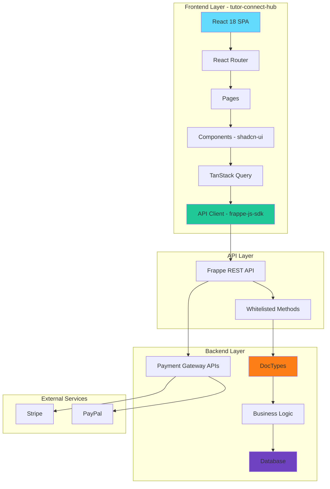
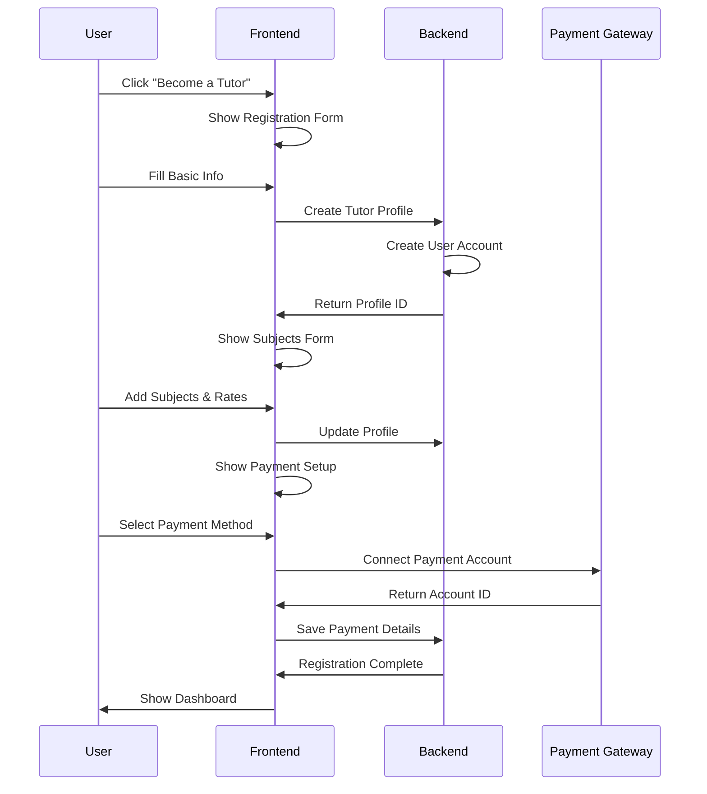
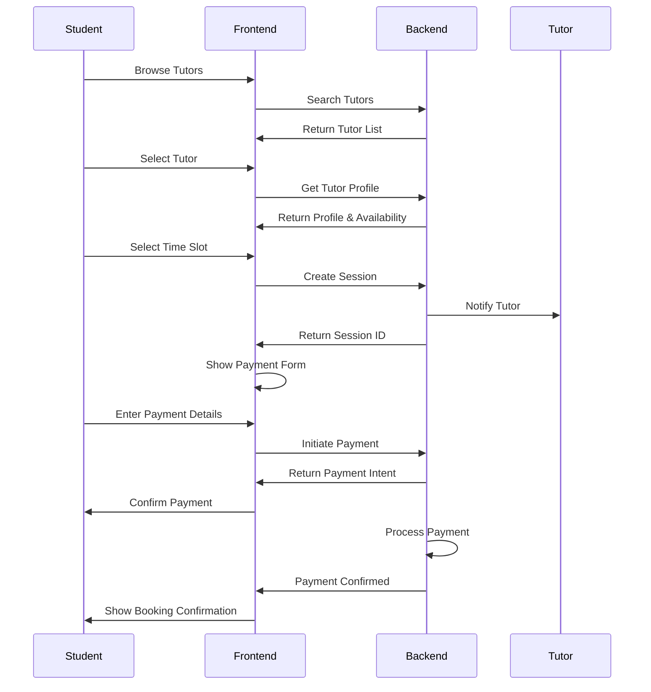
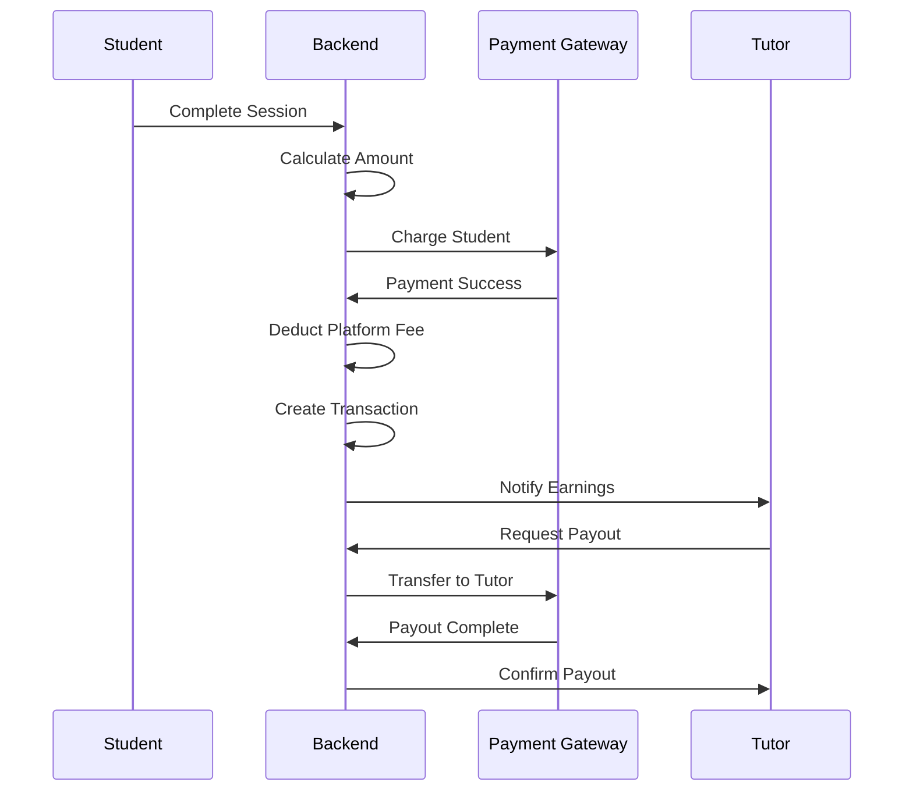

# Tutor Marketplace Architecture Plan

## Executive Summary

This document outlines the architecture for an online tutor marketplace application built on ERPNext/Frappe. The system will be deployed on a new site (`tuts.erpnext.zubbystudio.shop`) and will be developed as a new Frappe app that references/extends existing education doctypes where appropriate.

## System Overview

### Core Features
1. **Tutor Registration & Onboarding** - Multi-step registration with payment method setup
2. **Student Management** - Tutors can register their own students
3. **Scheduling System** - Flexible session scheduling with availability management
4. **Payment Processing** - Multi-gateway support (Stripe, PayPal) with configurable payout methods
5. **Marketplace Discovery** - Students can browse and find tutors
6. **Session Management** - Track sessions, attendance, and completion
7. **Financial Management** - Platform fees, tutor payouts, and transaction tracking
8. **Course Packages** - Bundled session packages with discounted pricing
9. **Subscriptions** - Recurring weekly/monthly sessions with automatic billing
10. **Group Sessions** - Multiple students per session with waitlist management

### Technology Stack

**Note**: An existing React frontend codebase (`tutor-connect-hub/`) has been generated by Lovable AI and will be used as the foundation for the frontend implementation. The frontend uses React 18, TypeScript, Vite, Tailwind CSS, and shadcn-ui components.

- **Backend**: Frappe/ERPNext (Python), Docker Compose, Traefik
- **Frontend**: React 18, Vite 6.0.3, Tailwind CSS 4.0.0, TypeScript 5.6.3
- **UI Components**: shadcn-ui (Radix UI primitives)
- **State Management**: TanStack Query 5.62.7
- **Form Handling**: React Hook Form 7.54.2 with Zod 3.24.1
- **Routing**: React Router DOM 7.1.1
- **Animation**: Framer Motion 11.15.0
- **Charts**: Recharts 2.15.0
- **Date Handling**: date-fns 4.1.0
- **Icons**: Lucide React 0.468.0
- **HTTP Client**: frappe-js-sdk (to be added)
- **Database**: MariaDB (via Frappe)
- **Payment Gateways**: Stripe, PayPal (with ERPNext integrations)
- **Deployment**: Docker, Traefik reverse proxy

---

## Architecture Diagram



---

## Data Model Design

### Core DocTypes

#### 1. Tutor Profile (tutor_marketplace.tutor_profile)
Extends: `education.instructor`

| Field | Type | Description |
|-------|------|-------------|
| `user` | Link to User | Frappe user account |
| `instructor` | Link to Instructor | Reference to education app |
| `bio` | Text | Professional biography |
| `subjects` | Table | List of subjects taught |
| `qualifications` | Table | Certifications and degrees |
| `hourly_rate` | Currency | Base hourly rate |
| `availability_settings` | JSON | Availability rules |
| `payment_method` | Select | Stripe, PayPal, Bank Transfer |
| `payment_account` | JSON | Payment account details |
| `is_verified` | Check | Admin verification status |
| `rating` | Float | Average rating (0-5) |
| `total_reviews` | Int | Number of reviews |
| `profile_image` | File Upload | Profile picture |
| `video_intro` | File Upload | Introduction video |
| `status` | Select | Active, Suspended, Pending |

#### 2. Student Profile (tutor_marketplace.student_profile)
Extends: `education.student`

| Field | Type | Description |
|-------|------|-------------|
| `user` | Link to User | Frappe user account |
| `student` | Link to Student | Reference to education app |
| `tutor` | Link to Tutor Profile | Assigned tutor |
| `guardian_email` | Email | Guardian contact |
| `guardian_phone` | Phone | Guardian contact |
| `learning_goals` | Text | Student objectives |
| `skill_level` | Select | Beginner, Intermediate, Advanced |
| `status` | Select | Active, Inactive |

#### 3. Tutor Subject (tutor_marketplace.tutor_subject)
Child table for Tutor Profile

| Field | Type | Description |
|-------|------|-------------|
| `subject` | Link to Subject | Subject name |
| `level` | Select | Beginner, Intermediate, Advanced |
| `experience_years` | Int | Years of experience |
| `rate_adjustment` | Currency | Rate adjustment per subject |

#### 4. Session Schedule (tutor_marketplace.session_schedule)

| Field | Type | Description |
|-------|------|-------------|
| `tutor` | Link to Tutor Profile | Tutor conducting session |
| `student` | Link to Student Profile | Student attending (null for group sessions) |
| `subject` | Link to Subject | Subject being taught |
| `scheduled_date` | Date | Session date |
| `start_time` | Time | Start time |
| `end_time` | Time | End time |
| `duration_minutes` | Int | Session duration |
| `session_type` | Select | One-on-One, Group, Online, In-person |
| `max_students` | Int | Maximum students for group session |
| `current_students` | Int | Current number of enrolled students |
| `min_students` | Int | Minimum students required to proceed |
| `price_per_student` | Currency | Price per student (for group sessions) |
| `is_public` | Check | Whether session is publicly bookable |
| `enrollment_deadline` | Datetime | Deadline for students to enroll |
| `waitlist_enabled` | Check | Enable waitlist when full |
| `waitlist_max` | Int | Maximum waitlist size |
| `meeting_link` | Data | Video conference link |
| `status` | Select | Scheduled, In Progress, Completed, Cancelled, No Show |
| `notes` | Text | Session notes |
| `recording_link` | Data | Session recording |
| `attendance_confirmed` | Check | Attendance confirmation |
| `package_purchase` | Link to Course Package Purchase | Related package purchase (if applicable) |
| `subscription` | Link to Subscription | Related subscription (if applicable) |

#### 5. Payment Transaction (tutor_marketplace.payment_transaction)

| Field | Type | Description |
|-------|------|-------------|
| `session` | Link to Session Schedule | Related session |
| `tutor` | Link to Tutor Profile | Tutor receiving payment |
| `student` | Link to Student Profile | Student making payment |
| `amount` | Currency | Total amount |
| `platform_fee` | Currency | Platform commission |
| `tutor_payout` | Currency | Amount paid to tutor |
| `payment_gateway` | Select | Stripe, PayPal |
| `transaction_id` | Data | Gateway transaction ID |
| `status` | Select | Pending, Completed, Failed, Refunded |
| `payout_status` | Select | Pending, Paid, Failed |
| `payout_date` | Date | Date paid to tutor |
| `created_at` | Datetime | Transaction timestamp |
| `transaction_type` | Select | Single Session, Course Package, Subscription, Group Session |
| `package_purchase` | Link to Course Package Purchase | Related package purchase |
| `subscription_billing` | Link to Subscription Billing | Related subscription billing |
| `group_enrollment` | Link to Group Session Enrollment | Related group enrollment |
| `is_recurring` | Check | Whether this is a recurring payment |
| `recurrence_id` | Data | Recurrence ID for subscription payments |

#### 6. Tutor Availability (tutor_marketplace.tutor_availability)

| Field | Type | Description |
|-------|------|-------------|
| `tutor` | Link to Tutor Profile | Tutor availability |
| `day_of_week` | Select | Monday-Sunday |
| `start_time` | Time | Available from |
| `end_time` | Time | Available until |
| `is_available` | Check | Availability status |
| `timezone` | Data | Tutor timezone |

#### 7. Tutor Review (tutor_marketplace.tutor_review)

| Field | Type | Description |
|-------|------|-------------|
| `tutor` | Link to Tutor Profile | Tutor being reviewed |
| `student` | Link to Student Profile | Student writing review |
| `session` | Link to Session Schedule | Related session |
| `rating` | Int | Rating (1-5) |
| `comment` | Text | Review text |
| `is_verified` | Check | Admin verification |
| `created_at` | Datetime | Review date |

#### 8. Marketplace Settings (tutor_marketplace.marketplace_settings)
Single DocType

| Field | Type | Description |
|-------|------|-------------|
| `platform_fee_percentage` | Percent | Platform commission rate |
| `minimum_payout_amount` | Currency | Minimum for payouts |
| `payout_frequency` | Select | Daily, Weekly, Monthly |
| `require_tutor_verification` | Check | Require admin approval |
| `enable_student_registration` | Check | Allow self-registration |
| `supported_payment_gateways` | Table | Available gateways |

#### 9. Tutor Qualification (tutor_marketplace.tutor_qualification)
Child table for Tutor Profile

| Field | Type | Description |
|-------|------|-------------|
| `qualification_type` | Select | Degree, Certificate, License |
| `institution` | Data | Issuing institution |
| `degree_name` | Data | Qualification name |
| `year_obtained` | Year | Completion year |
| `document` | File Upload | Proof document |

#### 10. Course Package (tutor_marketplace.course_package)

| Field | Type | Description |
|-------|------|-------------|
| `name` | Data | Package name (auto-generated: PKG-TUTOR-001) |
| `tutor` | Link to Tutor Profile | Tutor creating the package |
| `package_name` | Data | Display name (e.g., "10-Session Math Bundle") |
| `description` | Text | Package description |
| `subject` | Link to Subject | Subject covered |
| `total_sessions` | Int | Number of sessions included |
| `original_price` | Currency | Total price without discount |
| `discounted_price` | Currency | Discounted package price |
| `discount_percentage` | Percent | Discount percentage (calculated) |
| `validity_days` | Int | Number of days package is valid after purchase |
| `max_students` | Int | Maximum number of students who can purchase (0 = unlimited) |
| `is_active` | Check | Package availability status |
| `created_at` | Datetime | Creation timestamp |
| `expires_at` | Datetime | Package expiration date (optional) |
| `terms` | Text | Package terms and conditions |
| `what_included` | Text | What's included in the package |
| `image` | File Upload | Package promotional image |
| `status` | Select | Active, Inactive, Sold Out |

#### 11. Course Package Purchase (tutor_marketplace.course_package_purchase)

| Field | Type | Description |
|-------|------|-------------|
| `name` | Data | Purchase ID (auto-generated: PUR-001) |
| `package` | Link to Course Package | Purchased package |
| `student` | Link to Student Profile | Student who purchased |
| `tutor` | Link to Tutor Profile | Tutor who created package |
| `purchase_date` | Datetime | Purchase timestamp |
| `amount_paid` | Currency | Amount paid |
| `payment_gateway` | Select | Stripe, PayPal |
| `transaction_id` | Data | Payment transaction ID |
| `sessions_remaining` | Int | Sessions remaining from package |
| `valid_until` | Date | Package validity end date |
| `status` | Select | Active, Completed, Expired, Cancelled |
| `auto_renew` | Check | Auto-renew when sessions exhausted |

#### 12. Package Session (tutor_marketplace.package_session)

| Field | Type | Description |
|-------|------|-------------|
| `name` | Data | Session ID (auto-generated) |
| `package_purchase` | Link to Course Package Purchase | Related purchase |
| `session_schedule` | Link to Session Schedule | Scheduled session |
| `session_number` | Int | Session number within package (1, 2, 3...) |
| `status` | Select | Scheduled, Completed, Cancelled, No Show |
| `used_at` | Datetime | When session was used |

#### 13. Subscription Plan (tutor_marketplace.subscription_plan)

| Field | Type | Description |
|-------|------|-------------|
| `name` | Data | Plan name (auto-generated: SUB-TUTOR-001) |
| `tutor` | Link to Tutor Profile | Tutor creating the plan |
| `plan_name` | Data | Display name (e.g., "Weekly Math Tutoring") |
| `description` | Text | Plan description |
| `subject` | Link to Subject | Subject covered |
| `billing_cycle` | Select | Weekly, Bi-weekly, Monthly |
| `sessions_per_cycle` | Int | Number of sessions per billing cycle |
| `price_per_cycle` | Currency | Price per billing cycle |
| `session_duration` | Int | Session duration in minutes |
| `preferred_days` | Table | Preferred days of week |
| `preferred_time_start` | Time | Preferred start time |
| `preferred_time_end` | Time | Preferred end time |
| `max_subscribers` | Int | Maximum subscribers (0 = unlimited) |
| `trial_sessions` | Int | Number of free trial sessions |
| `cancellation_notice_days` | Int | Days notice required for cancellation |
| `is_active` | Check | Plan availability status |
| `created_at` | Datetime | Creation timestamp |
| `terms` | Text | Plan terms and conditions |
| `what_included` | Text | What's included in the subscription |
| `image` | File Upload | Plan promotional image |
| `status` | Select | Active, Inactive, Full |

#### 14. Subscription (tutor_marketplace.subscription)

| Field | Type | Description |
|-------|------|-------------|
| `name` | Data | Subscription ID (auto-generated: SUBS-001) |
| `plan` | Link to Subscription Plan | Subscribed plan |
| `student` | Link to Student Profile | Student subscriber |
| `tutor` | Link to Tutor Profile | Tutor providing subscription |
| `start_date` | Date | Subscription start date |
| `next_billing_date` | Date | Next billing date |
| `billing_cycle_count` | Int | Number of billing cycles completed |
| `total_paid` | Currency | Total amount paid |
| `sessions_used` | Int | Sessions used in current cycle |
| `sessions_remaining` | Int | Sessions remaining in current cycle |
| `status` | Select | Active, Paused, Cancelled, Expired |
| `auto_renew` | Check | Auto-renew subscription |
| `trial_used` | Check | Trial sessions used |
| `trial_sessions_remaining` | Int | Trial sessions remaining |
| `cancel_requested_at` | Datetime | When cancellation was requested |
| `cancel_effective_date` | Date | When cancellation takes effect |
| `cancel_reason` | Text | Reason for cancellation |
| `notes` | Text | Subscription notes |

#### 15. Subscription Billing (tutor_marketplace.subscription_billing)

| Field | Type | Description |
|-------|------|-------------|
| `name` | Data | Billing ID (auto-generated: BILL-001) |
| `subscription` | Link to Subscription | Related subscription |
| `billing_cycle` | Int | Billing cycle number |
| `billing_date` | Date | Date billed |
| `amount` | Currency | Amount charged |
| `payment_gateway` | Select | Stripe, PayPal |
| `transaction_id` | Data | Payment transaction ID |
| `status` | Select | Pending, Paid, Failed, Refunded |
| `paid_at` | Datetime | Payment timestamp |
| `failure_reason` | Text | Reason for payment failure |
| `retry_count` | Int | Number of retry attempts |

#### 16. Subscription Session (tutor_marketplace.subscription_session)

| Field | Type | Description |
|-------|------|-------------|
| `name` | Data | Session ID (auto-generated) |
| `subscription` | Link to Subscription | Related subscription |
| `subscription_billing` | Link to Subscription Billing | Related billing cycle |
| `session_schedule` | Link to Session Schedule | Scheduled session |
| `session_number` | Int | Session number in current cycle |
| `cycle_number` | Int | Billing cycle number |
| `status` | Select | Scheduled, Completed, Cancelled, No Show |
| `is_trial` | Check | Is this a trial session |
| `scheduled_at` | Datetime | When session was scheduled |

#### 17. Group Session Enrollment (tutor_marketplace.group_session_enrollment)

| Field | Type | Description |
|-------|------|-------------|
| `name` | Data | Enrollment ID (auto-generated: ENR-001) |
| `session` | Link to Session Schedule | Group session |
| `student` | Link to Student Profile | Enrolled student |
| `enrolled_at` | Datetime | Enrollment timestamp |
| `enrollment_status` | Select | Enrolled, Waitlisted, Cancelled, No Show |
| `waitlist_position` | Int | Position in waitlist (if applicable) |
| `payment_status` | Select | Paid, Pending, Failed, Refunded |
| `payment_transaction` | Link to Payment Transaction | Related payment |
| `amount_paid` | Currency | Amount paid by student |
| `joined_at` | Datetime | When student joined the session |
| `left_at` | Datetime | When student left (if applicable) |
| `notes` | Text | Enrollment notes |

#### 18. Group Session Waitlist (tutor_marketplace.group_session_waitlist)

| Field | Type | Description |
|-------|------|-------------|
| `name` | Data | Waitlist ID (auto-generated) |
| `session` | Link to Session Schedule | Group session |
| `student` | Link to Student Profile | Waitlisted student |
| `waitlisted_at` | Datetime | Waitlist timestamp |
| `position` | Int | Position in waitlist |
| `notified` | Check | Whether student was notified of availability |
| `notified_at` | Datetime | When notification was sent |
| `status` | Select | Waiting, Notified, Enrolled, Expired, Cancelled |

---

## API Endpoints Design

### Note: Additional API endpoints for Course Packages, Subscriptions, and Group Sessions are documented in `tutor-marketplace-features-additions.md`

### Public/Guest Endpoints

#### Landing Page
```
GET /api/method/tutor_marketplace.api.get_marketplace_data
Response: {
  hero_section: {...},
  featured_tutors: [...],
  testimonials: [...],
  stats: {...}
}
```

#### Tutor Discovery
```
GET /api/method/tutor_marketplace.api.search_tutors
Query Parameters: subject, level, min_rate, max_rate, rating
Response: {
  tutors: [...],
  total: number,
  page: number
}
```

```
GET /api/method/tutor_marketplace.api.get_tutor_profile
Query Parameters: tutor_id
Response: {
  tutor: {...},
  subjects: [...],
  reviews: [...],
  availability: [...]
}
```

### Authenticated Endpoints

#### Tutor Management
```
POST /api/method/tutor_marketplace.api.create_tutor_profile
Body: { bio, subjects, qualifications, payment_method, payment_account }
Response: { tutor_id, status }
```

```
PUT /api/method/tutor_marketplace.api.update_tutor_profile
Body: { tutor_id, updates }
Response: { success: true }
```

```
POST /api/method/tutor_marketplace.api.update_availability
Body: { tutor_id, availability }
Response: { success: true }
```

#### Student Management
```
POST /api/method/tutor_marketplace.api.register_student
Body: { student_data, tutor_id }
Response: { student_id, status }
```

```
GET /api/method/tutor_marketplace.api.get_my_students
Query Parameters: tutor_id
Response: { students: [...] }
```

#### Scheduling
```
POST /api/method/tutor_marketplace.api.create_session
Body: { tutor_id, student_id, subject, date, start_time, end_time }
Response: { session_id, status }
```

```
GET /api/method/tutor_marketplace.api.get_tutor_schedule
Query Parameters: tutor_id, start_date, end_date
Response: { sessions: [...] }
```

```
PUT /api/method/tutor_marketplace.api.update_session_status
Body: { session_id, status, notes }
Response: { success: true }
```

#### Payments
```
POST /api/method/tutor_marketplace.api.initiate_payment
Body: { session_id, payment_gateway, payment_method_id }
Response: { payment_intent, client_secret }
```

```
POST /api/method/tutor_marketplace.api.confirm_payment
Body: { payment_intent_id, payment_gateway }
Response: { transaction_id, status }
```

```
GET /api/method/tutor_marketplace.api.get_tutor_earnings
Query Parameters: tutor_id, start_date, end_date
Response: {
  total_earnings: number,
  pending_payouts: number,
  completed_payouts: number,
  transactions: [...]
}
```

```
GET /api/method/tutor_marketplace.api.request_payout
Body: { tutor_id, amount }
Response: { payout_id, status }
```

#### Reviews
```
POST /api/method/tutor_marketplace.api.submit_review
Body: { tutor_id, session_id, rating, comment }
Response: { review_id, status }
```

```
GET /api/method/tutor_marketplace.api.get_tutor_reviews
Query Parameters: tutor_id, page, limit
Response: { reviews: [...], total: number }
```

---

## Frontend Architecture

**Note**: The existing frontend codebase (`tutor-connect-hub/`) already has a solid foundation with React 18, Vite, Tailwind CSS, and shadcn-ui components. The following structure shows the additional pages and components needed to complete the application.

### Existing Frontend Structure

```
tutor-connect-hub/
├── src/
│   ├── components/
│   │   ├── home/               # Landing page sections (existing)
│   │   ├── layout/             # Header, Footer (existing)
│   │   └── ui/                 # shadcn-ui components (existing)
│   ├── pages/
│   │   ├── Index.tsx           # Landing page (existing)
│   │   └── NotFound.tsx        # 404 page (existing)
│   ├── lib/
│   │   └── utils.ts            # Utility functions (existing)
│   ├── App.tsx                 # Main app (existing)
│   ├── main.tsx                # Entry point (existing)
│   └── index.css               # Global styles (existing)
```

### New Pages to Add

```
src/
├── pages/
│   ├── Index.tsx                    # Landing page (existing)
│   ├── tutors/
│   │   ├── Index.tsx               # Tutor listing page
│   │   └── [id].tsx                # Tutor profile page
│   ├── subjects/
│   │   └── Index.tsx               # Subjects listing page
│   ├── pricing/
│   │   └── Index.tsx               # Pricing page
│   ├── auth/
│   │   ├── Login.tsx               # Login page
│   │   ├── Register.tsx            # Registration page
│   │   └── ForgotPassword.tsx      # Forgot password page
│   ├── tutor/
│   │   ├── Dashboard.tsx           # Tutor dashboard
│   │   ├── Profile.tsx             # Tutor profile editing
│   │   ├── Schedule.tsx            # Schedule management
│   │   ├── Students.tsx            # Student management
│   │   ├── Sessions.tsx            # Session management
│   │   ├── Earnings.tsx            # Earnings & payouts
│   │   ├── Packages.tsx            # Course packages management
│   │   ├── CreatePackage.tsx       # Create course package
│   │   ├── Subscriptions.tsx       # Subscription plans management
│   │   ├── CreateSubscription.tsx  # Create subscription plan
│   │   ├── GroupSessions.tsx       # Group sessions management
│   │   └── CreateGroupSession.tsx  # Create group session
│   ├── student/
│   │   ├── Dashboard.tsx           # Student dashboard
│   │   ├── Bookings.tsx            # My bookings
│   │   ├── Sessions.tsx            # My sessions
│   │   ├── Payments.tsx            # Payment history
│   │   ├── Packages.tsx            # Browse course packages
│   │   ├── PackagePurchase.tsx     # Package purchase
│   │   ├── MyPackages.tsx          # My purchased packages
│   │   ├── Subscriptions.tsx       # Browse subscription plans
│   │   ├── MySubscriptions.tsx     # My subscriptions
│   │   ├── GroupSessions.tsx       # Browse group sessions
│   │   └── MyGroupSessions.tsx     # My group sessions
│   ├── admin/
│   │   ├── Dashboard.tsx           # Admin dashboard
│   │   ├── Tutors.tsx              # Manage tutors
│   │   ├── Students.tsx            # Manage students
│   │   └── Payments.tsx            # Manage payments
│   └── NotFound.tsx                # 404 page (existing)
```

### New Components to Add

```
src/
├── components/
│   ├── home/                       # Landing page sections (existing)
│   ├── layout/                     # Header, Footer (existing)
│   ├── ui/                         # shadcn-ui components (existing)
│   ├── tutor/
│   │   ├── TutorCard.tsx           # Display tutor information
│   │   ├── TutorSearchFilters.tsx  # Search and filter tutors
│   │   ├── AvailabilityCalendar.tsx # Calendar for availability
│   │   ├── SessionForm.tsx         # Create/edit session form
│   │   ├── StudentCard.tsx         # Display student information
│   │   ├── EarningsSummary.tsx     # Display earnings summary
│   │   ├── PayoutHistory.tsx       # Display payout history
│   │   ├── CoursePackageCard.tsx   # Display package information
│   │   ├── CoursePackageForm.tsx   # Create/edit package form
│   │   ├── CoursePackageList.tsx   # List packages
│   │   ├── PackagePurchaseForm.tsx # Purchase package form
│   │   ├── PackageSessionsList.tsx # List package sessions
│   │   ├── SubscriptionPlanCard.tsx # Display subscription plan
│   │   ├── SubscriptionPlanForm.tsx # Create/edit subscription form
│   │   ├── SubscriptionList.tsx    # List subscriptions
│   │   ├── SubscribeForm.tsx       # Subscribe to plan form
│   │   ├── SubscriptionDetails.tsx # Display subscription details
│   │   ├── SubscriptionBillingHistory.tsx # Billing history
│   │   ├── SubscriptionSessionsList.tsx # List subscription sessions
│   │   ├── GroupSessionCard.tsx    # Display group session
│   │   ├── GroupSessionForm.tsx    # Create/edit group session form
│   │   ├── GroupSessionList.tsx    # List group sessions
│   │   ├── GroupSessionEnrollmentForm.tsx # Enroll in group session
│   │   ├── GroupSessionEnrollments.tsx # List enrollments
│   │   ├── WaitlistManager.tsx     # Manage waitlist
│   │   └── GroupSessionDetails.tsx # Display group session details
│   ├── student/
│   │   ├── SessionCard.tsx         # Display session information
│   │   ├── BookingModal.tsx        # Booking modal
│   │   ├── PaymentForm.tsx         # Payment form
│   │   ├── ReviewForm.tsx          # Submit review form
│   │   ├── CoursePackageBrowser.tsx # Browse packages
│   │   ├── PackagePurchaseCard.tsx  # Package purchase card
│   │   ├── SubscriptionPlanBrowser.tsx # Browse subscription plans
│   │   ├── MySubscriptions.tsx     # My subscriptions list
│   │   ├── GroupSessionBrowser.tsx  # Browse group sessions
│   │   ├── GroupSessionEnrollmentCard.tsx # Enrollment card
│   │   └── MyGroupSessions.tsx     # My group sessions
│   ├── common/
│   │   ├── RatingStars.tsx         # Display rating stars
│   │   ├── SubjectBadge.tsx        # Display subject badge
│   │   ├── StatusBadge.tsx         # Display status badge
│   │   ├── LoadingSpinner.tsx      # Loading indicator
│   │   └── ErrorAlert.tsx          # Error alert
│   └── dashboard/
│       ├── DashboardStats.tsx      # Dashboard statistics
│       ├── UpcomingSessions.tsx    # Upcoming sessions list
│       ├── RecentBookings.tsx      # Recent bookings list
│       ├── EarningsChart.tsx       # Earnings chart
│       ├── SessionHistory.tsx       # Session history
│       ├── PaymentHistory.tsx      # Payment history
│       ├── StudentList.tsx         # Student list
│       └── TutorList.tsx           # Tutor list
```

### State Management

Using React 18 Hooks with React Query for server state:

```typescript
// hooks/useTutor.ts
import { useQuery, useMutation, useQueryClient } from '@tanstack/react-query'

export function useTutor(tutorId: string) {
  const queryClient = useQueryClient()
  
  const { data: tutor, isLoading, error } = useQuery({
    queryKey: ['tutor', tutorId],
    queryFn: async () => {
      const response = await frappe.call({
        method: 'tutor_marketplace.api.get_tutor_profile',
        args: { tutor_id: tutorId }
      })
      return response.message.tutor
    }
  })

  const updateMutation = useMutation({
    mutationFn: async (updates: any) => {
      const response = await frappe.call({
        method: 'tutor_marketplace.api.update_tutor_profile',
        args: { tutor_id: tutorId, ...updates }
      })
      return response.message
    },
    onSuccess: () => {
      queryClient.invalidateQueries({ queryKey: ['tutor', tutorId] })
    }
  })

  return { tutor, isLoading, error, updateMutation }
}
```

### API Client

**Note**: The existing frontend uses TanStack Query for server state management. The following API client will be added to integrate with the Frappe backend.

```typescript
// lib/api-client.ts
import { frappe } from 'frappe-js-sdk';

// Initialize Frappe client
const frappeClient = frappe({
  url: import.meta.env.VITE_FRAPPE_URL || 'https://tuts.erpnext.zubbystudio.shop',
  token: () => localStorage.getItem('frappe_token'),
});

// API methods for each DocType
export const api = {
  // Tutors
  getTutors: (params?: any) => frappeClient.getDocList('Tutor Profile', params),
  getTutor: (name: string) => frappeClient.getDoc('Tutor Profile', name),
  createTutor: (data: any) => frappeClient.insertDoc('Tutor Profile', data),
  updateTutor: (name: string, data: any) => frappeClient.setValue('Tutor Profile', name, data),
  
  // Students
  getStudents: (params?: any) => frappeClient.getDocList('Student Profile', params),
  getStudent: (name: string) => frappeClient.getDoc('Student Profile', name),
  createStudent: (data: any) => frappeClient.insertDoc('Student Profile', data),
  
  // Sessions
  getSessions: (params?: any) => frappeClient.getDocList('Session Schedule', params),
  getSession: (name: string) => frappeClient.getDoc('Session Schedule', name),
  createSession: (data: any) => frappeClient.insertDoc('Session Schedule', data),
  updateSession: (name: string, data: any) => frappeClient.setValue('Session Schedule', name, data),
  
  // Bookings
  getBookings: (params?: any) => frappeClient.getDocList('Booking', params),
  createBooking: (data: any) => frappeClient.insertDoc('Booking', data),
  
  // Payments
  getPayments: (params?: any) => frappeClient.getDocList('Payment Transaction', params),
  createPayment: (data: any) => frappeClient.insertDoc('Payment Transaction', data),
  
  // Course Packages
  getPackages: (params?: any) => frappeClient.getDocList('Course Package', params),
  getPackage: (name: string) => frappeClient.getDoc('Course Package', name),
  createPackage: (data: any) => frappeClient.insertDoc('Course Package', data),
  getPackagePurchases: (params?: any) => frappeClient.getDocList('Course Package Purchase', params),
  
  // Subscriptions
  getSubscriptions: (params?: any) => frappeClient.getDocList('Subscription', params),
  getSubscription: (name: string) => frappeClient.getDoc('Subscription', name),
  getSubscriptionPlans: (params?: any) => frappeClient.getDocList('Subscription Plan', params),
  createSubscriptionPlan: (data: any) => frappeClient.insertDoc('Subscription Plan', data),
  
  // Group Sessions
  getGroupSessions: (params?: any) => frappeClient.getDocList('Group Session', params),
  getGroupSession: (name: string) => frappeClient.getDoc('Group Session', name),
  
  // Custom API methods
  getLandingPageData: () => frappeClient.call('tutor_marketplace.api.get_marketplace_data'),
  searchTutors: (query: string) => frappeClient.call('tutor_marketplace.api.search_tutors', { query }),
  getTutorProfile: (tutorId: string) => frappeClient.call('tutor_marketplace.api.get_tutor_profile', { tutor_id: tutorId }),
  getTutorSchedule: (tutorId: string, startDate: string, endDate: string) =>
    frappeClient.call('tutor_marketplace.api.get_tutor_schedule', { tutor_id: tutorId, start_date: startDate, end_date: endDate }),
  getTutorEarnings: (tutorId: string, startDate: string, endDate: string) =>
    frappeClient.call('tutor_marketplace.api.get_tutor_earnings', { tutor_id: tutorId, start_date: startDate, end_date: endDate }),
  initiatePayment: (sessionId: string, paymentGateway: string, paymentMethodId: string) =>
    frappeClient.call('tutor_marketplace.api.initiate_payment', { session_id: sessionId, payment_gateway: paymentGateway, payment_method_id: paymentMethodId }),
  confirmPayment: (paymentIntentId: string, paymentGateway: string) =>
    frappeClient.call('tutor_marketplace.api.confirm_payment', { payment_intent_id: paymentIntentId, payment_gateway: paymentGateway }),
  submitReview: (tutorId: string, sessionId: string, rating: number, comment: string) =>
    frappeClient.call('tutor_marketplace.api.submit_review', { tutor_id: tutorId, session_id: sessionId, rating, comment }),
  getTutorReviews: (tutorId: string, page: number, limit: number) =>
    frappeClient.call('tutor_marketplace.api.get_tutor_reviews', { tutor_id: tutorId, page, limit }),
};

export default api;
```

---

## User Flows

### Tutor Registration Flow



### Session Booking Flow



### Payment & Payout Flow



---

## Agent Responsibilities

### Frontend Agent (React 18 + Tailwind + shadcn-ui)

**Primary Focus**: `tutor-connect-hub/` (existing React frontend)

**Core Responsibilities**:
1. Extend the existing React 18 frontend with new pages and components
2. Build responsive UI components using React hooks, Vite, and Tailwind CSS
3. Leverage existing shadcn-ui components and create new ones as needed
4. Integrate with Frappe REST API using frappe-js-sdk
5. Use TanStack Query for server state management
6. Use React Hook Form with Zod for form validation
7. Handle loading states, error states, and form validation
8. Implement real-time updates where needed
9. Ensure mobile responsiveness and accessibility
10. Mock data when backend is unavailable

**Constraints**:
- DO NOT modify Docker configurations, Nginx configs, or Python backend code
- DO NOT attempt to fix server-side errors or database issues
- DO NOT modify payment gateway integrations
- FOCUS on `tutor-connect-hub/src/`, `tailwind.config.ts`, `vite.config.ts`, and visual fidelity
- Maintain the existing design system (colors, typography, components)

**Key Tasks**:
- Add frappe-js-sdk dependency and create API client module
- Implement authentication context and protected routes
- Implement tutor registration multi-step form
- Build tutor discovery and search interface
- Create scheduling calendar component
- Design payment forms for both Stripe and PayPal
- Build tutor dashboard with analytics
- Create student booking flow
- Implement review and rating system
- Design responsive layouts for all devices
- Create course packages, subscriptions, and group sessions UI

### Backend Agent (Frappe/Docker)

**Primary Focus**: `apps/tutor_marketplace/` and Docker infrastructure

**Core Responsibilities**:
1. Create and configure all DocTypes
2. Implement whitelisted API methods
3. Integrate payment gateways (Stripe, PayPal)
4. Set up database relationships and indexes
5. Implement business logic (fees, payouts, availability)
6. Configure Docker containers and networking
7. Set up Traefik routing for the new site
8. Ensure proper permissions and security
9. Create data migrations if needed
10. Implement email notifications

**Constraints**:
- DO NOT spend time on CSS, HTML layout, or Vue.js component logic
- DO NOT worry about visual aesthetics
- FOCUS on `docker-compose.yml`, DocTypes, API methods, and Python code

**Key Tasks**:
- Create new Frappe app `tutor_marketplace`
- Define all DocTypes with proper relationships
- Implement API endpoints for all operations
- Integrate Stripe and PayPal payment gateways
- Set up automated payout processing
- Configure availability scheduling logic
- Implement review aggregation and rating calculations
- Set up email notifications for sessions and payments
- Configure site `tuts.erpnext.zubbystudio.shop`
- Ensure proper data validation and security

---

## Implementation Phases

### Phase 1: Foundation (Week 1-2)

**Backend**:
- Create `tutor_marketplace` Frappe app
- Set up basic DocTypes (Tutor Profile, Student Profile, Session Schedule)
- Configure site `tuts.erpnext.zubbystudio.shop`
- Set up Docker configuration for new site

**Frontend**:
- Set up Vue project structure
- Create base layout components (Header, Footer)
- Implement landing page
- Set up routing

### Phase 2: Tutor Registration & Profile (Week 3-4)

**Backend**:
- Implement Tutor Profile DocType with child tables
- Create registration API endpoints
- Set up user account creation
- Implement profile update endpoints

**Frontend**:
- Build multi-step tutor registration form
- Create tutor profile page (public view)
- Implement profile editing interface
- Add subject and qualification management

### Phase 3: Student Management (Week 5)

**Backend**:
- Implement Student Profile DocType
- Create student registration API
- Implement tutor-student relationship management

**Frontend**:
- Build student registration form
- Create student dashboard
- Implement student profile management

### Phase 4: Scheduling System (Week 6-7)

**Backend**:
- Create Session Schedule DocType
- Implement availability management DocType
- Create scheduling API endpoints
- Implement conflict detection logic

**Frontend**:
- Build availability calendar component
- Create session booking interface
- Implement schedule dashboard for tutors
- Add session status management

### Phase 5: Payment Integration (Week 8-10)

**Backend**:
- Integrate Stripe payment gateway
- Integrate PayPal payment gateway
- Create Payment Transaction DocType
- Implement payment processing logic
- Set up platform fee calculation
- Implement payout processing

**Frontend**:
- Build payment method setup forms
- Create payment confirmation interface
- Implement payment history views
- Build earnings dashboard for tutors
- Add payout request interface

### Phase 6: Marketplace Features (Week 11-12)

**Backend**:
- Implement tutor search and filtering
- Create review and rating system
- Implement review aggregation logic
- Create marketplace settings DocType

**Frontend**:
- Build tutor discovery page with filters
- Implement search functionality
- Create review submission form
- Display tutor ratings and reviews
- Add testimonials section

### Phase 7: Notifications & Communication (Week 13)

**Backend**:
- Set up email notifications for sessions
- Implement payment confirmation emails
- Create reminder system for sessions
- Set up payout notifications

**Frontend**:
- Add notification center component
- Display session reminders
- Show payment confirmations

### Phase 8: Testing & Deployment (Week 14)

**Both**:
- End-to-end testing of all flows
- Security audit
- Performance optimization
- Documentation
- Production deployment

### Phase 9: Course Packages (Week 15-16)

**Backend**:
- Create Course Package DocType and child tables
- Create Course Package Purchase DocType
- Create Package Session DocType
- Implement package management APIs
- Implement package purchase APIs
- Implement package session booking APIs

**Frontend**:
- Build package management UI
- Build package purchase UI
- Create package browsing interface
- Implement package session booking flow
- Test package flows

### Phase 10: Subscriptions (Week 17-19)

**Backend**:
- Create Subscription Plan DocType and child tables
- Create Subscription DocType
- Create Subscription Billing DocType
- Create Subscription Session DocType
- Implement subscription plan management APIs
- Implement subscription APIs
- Implement subscription billing APIs
- Implement subscription session APIs
- Set up recurring payment processing

**Frontend**:
- Build subscription plan UI
- Build subscription UI
- Create subscription browsing interface
- Implement subscription flow
- Build billing history views
- Test subscription flows

### Phase 11: Group Sessions (Week 20-21)

**Backend**:
- Update Session Schedule DocType for group sessions
- Create Group Session Enrollment DocType
- Create Group Session Waitlist DocType
- Implement group session management APIs
- Implement group session enrollment APIs
- Implement waitlist management APIs

**Frontend**:
- Build group session UI
- Build enrollment UI
- Create group session browsing interface
- Implement waitlist management UI
- Test group session flows

### Phase 12: Integration & Testing (Week 22-23)

**Both**:
- Test all three features together
- Test payment flows for all features
- Test notification systems
- Test background jobs
- Performance testing
- Security testing
- User acceptance testing

---

## Security Considerations

1. **Authentication**: Use Frappe's built-in authentication system
2. **Authorization**: Implement role-based access control
   - `Tutor`: Can manage profile, students, schedule
   - `Student`: Can book sessions, view tutors
   - `System Manager`: Full access
3. **Payment Security**: Never store full payment details, use tokens
4. **Data Validation**: Server-side validation for all inputs
5. **Rate Limiting**: Implement API rate limiting
6. **HTTPS**: Enforce HTTPS for all connections
7. **CSRF Protection**: Use Frappe's CSRF tokens
8. **XSS Prevention**: Sanitize all user inputs

---

## Scalability Considerations

1. **Database Indexing**: Add indexes on frequently queried fields
2. **Caching**: Implement Redis caching for tutor profiles and availability
3. **Background Jobs**: Use Frappe's background jobs for:
   - Payment processing
   - Email notifications
   - Payout calculations
4. **CDN**: Serve static assets via CDN
5. **Load Balancing**: Configure Traefik for load balancing
6. **Database Sharding**: Consider if user base grows significantly

---

## Monitoring & Analytics

1. **Application Metrics**:
   - Active tutors
   - Active students
   - Sessions booked
   - Revenue generated
   - Platform fees collected

2. **Technical Metrics**:
   - API response times
   - Error rates
   - Payment success rates
   - Container health

3. **User Analytics**:
   - Tutor registration conversion
   - Student booking conversion
   - Session completion rates
   - Average session duration

---

## Next Steps

1. **Backend Agent**: Start by creating the `tutor_marketplace` Frappe app
2. **Frontend Agent**: Extend the existing `tutor-connect-hub/` React frontend with API integration
3. **Review**: Review this architecture document and approve
4. **Begin Phase 1**: Start implementation according to the phased approach

**Note**: The frontend implementation should leverage the existing React 18 codebase generated by Lovable AI. The frontend agent should focus on:
- Adding frappe-js-sdk dependency
- Creating API client module
- Implementing authentication context
- Adding new pages and components as outlined above
- Integrating with the Frappe backend API
- Maintaining the existing design system and component patterns

---

## Appendix: File Structure

### Backend Structure
```
apps/tutor_marketplace/
├── tutor_marketplace/
│   ├── __init__.py
│   ├── api.py                 # All whitelisted API methods
│   ├── hooks.py               # Frappe hooks
│   ├── modules.txt
│   ├── config/
│   │   └── __init__.py
│   ├── doctype/
│   │   ├── tutor_profile/
│   │   ├── student_profile/
│   │   ├── session_schedule/
│   │   ├── payment_transaction/
│   │   ├── tutor_availability/
│   │   ├── tutor_review/
│   │   └── marketplace_settings/
│   └── templates/
│       └── pages/
├── public/
│   └── frontend/
└── frontend/                  # Vue frontend app
```

### Frontend Structure

**Note**: The frontend is located in `tutor-connect-hub/` (existing React 18 codebase generated by Lovable AI).

```
tutor-connect-hub/
├── src/
│   ├── components/               # Existing and new components
│   │   ├── home/                 # Landing page sections (existing)
│   │   ├── layout/               # Header, Footer (existing)
│   │   ├── ui/                   # shadcn-ui components (existing)
│   │   ├── tutor/                # Tutor-related components (new)
│   │   ├── student/              # Student-related components (new)
│   │   ├── common/               # Common components (new)
│   │   └── dashboard/            # Dashboard components (new)
│   ├── pages/                    # Page components
│   │   ├── Index.tsx             # Landing page (existing)
│   │   ├── tutors/               # Tutor pages (new)
│   │   ├── subjects/             # Subjects page (new)
│   │   ├── pricing/              # Pricing page (new)
│   │   ├── auth/                 # Authentication pages (new)
│   │   ├── tutor/                # Tutor dashboard pages (new)
│   │   ├── student/              # Student dashboard pages (new)
│   │   ├── admin/                # Admin pages (new)
│   │   └── NotFound.tsx          # 404 page (existing)
│   ├── lib/
│   │   ├── api-client.ts         # Frappe API client (new)
│   │   └── utils.ts              # Utility functions (existing)
│   ├── contexts/                 # React contexts (new)
│   │   └── AuthContext.tsx       # Authentication context
│   ├── hooks/                    # Custom hooks (new)
│   │   ├── useAuth.ts            # Authentication hook
│   │   ├── useTutors.ts          # Tutors data hook
│   │   ├── useSessions.ts        # Sessions data hook
│   │   └── ...
│   ├── App.tsx                   # Main app (existing)
│   ├── main.tsx                  # Entry point (existing)
│   └── index.css                 # Global styles (existing)
├── public/                       # Static assets (existing)
├── package.json                  # Dependencies (existing)
├── vite.config.ts                # Vite configuration (existing)
├── tailwind.config.ts            # Tailwind configuration (existing)
└── tsconfig files                # TypeScript configurations (existing)
```
