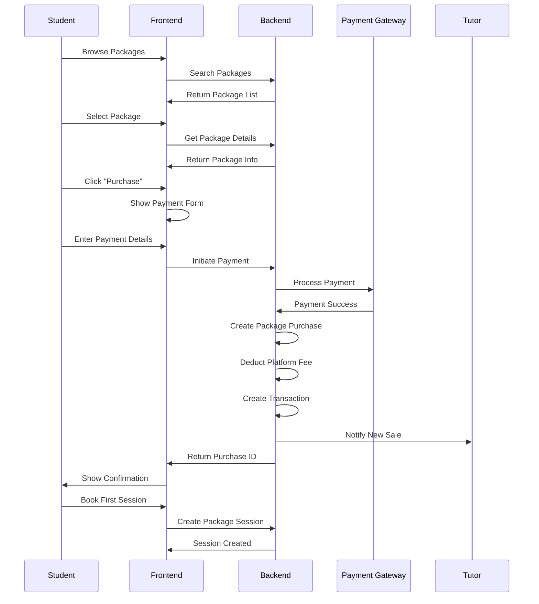
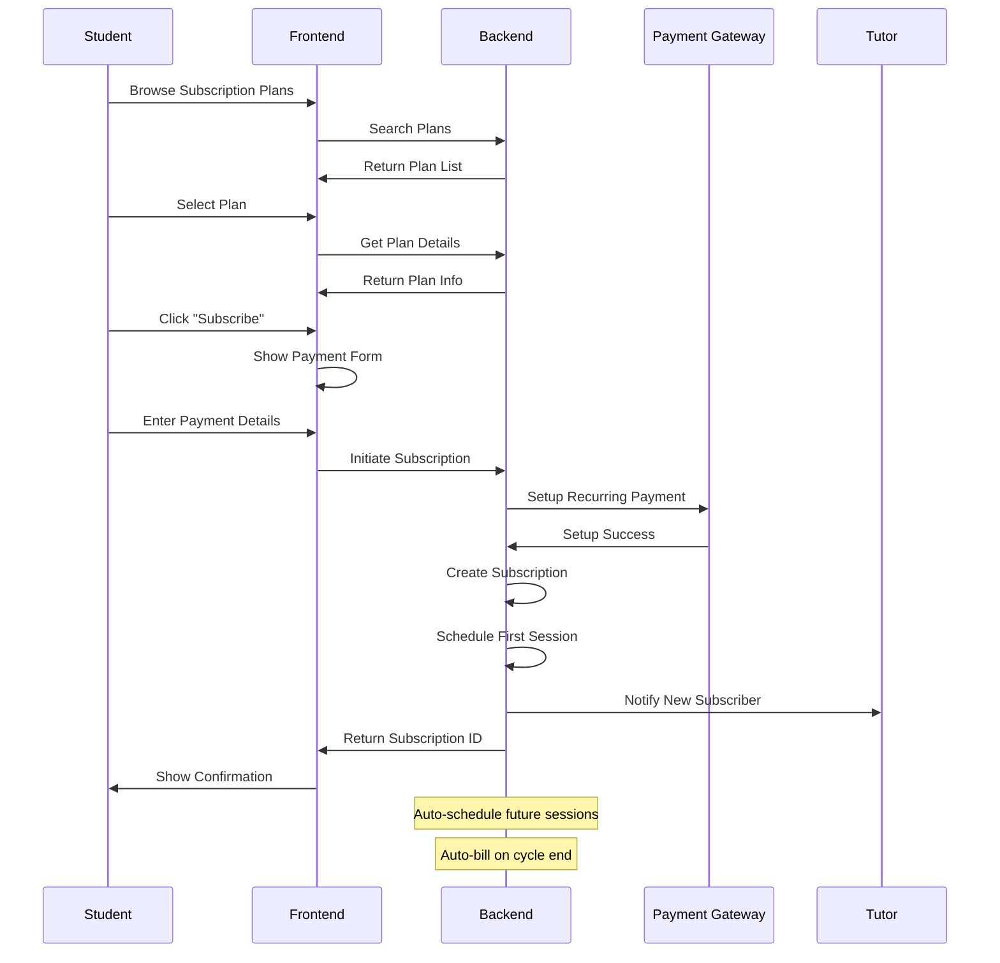
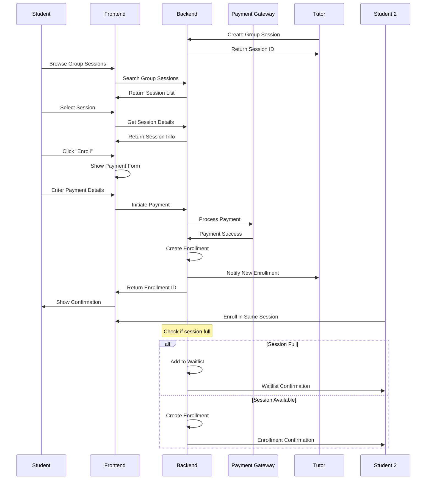

# Tutor Marketplace - Additional Features Architecture

## Overview

This document details the architecture for three additional features to be added to the Tutor Marketplace:

1. **Course Packages** - Bundles of sessions at discounted prices
2. **Subscriptions** - Recurring weekly/monthly sessions
3. **Group Sessions** - Multiple students per session

---

## 1. Course Packages

### Purpose
Allow tutors to create bundles of sessions (e.g., 10 sessions for a discounted price) that students can purchase upfront.

### Data Model

#### Course Package (tutor_marketplace.course_package)

| Field | Type | Description |
|-------|------|-------------|
| `name` | Data | Package name (auto-generated: PKG-TUTOR-001) |
| `tutor` | Link to Tutor Profile | Tutor creating the package |
| `package_name` | Data | Display name (e.g., "10-Session Math Bundle") |
| `description` | Text | Package description |
| `subject` | Link to Subject | Subject covered |
| `total_sessions` | Int | Number of sessions included |
| `original_price` | Currency | Total price without discount |
| `discounted_price` | Currency | Discounted package price |
| `discount_percentage` | Percent | Discount percentage (calculated) |
| `validity_days` | Int | Number of days package is valid after purchase |
| `max_students` | Int | Maximum number of students who can purchase (0 = unlimited) |
| `is_active` | Check | Package availability status |
| `created_at` | Datetime | Creation timestamp |
| `expires_at` | Datetime | Package expiration date (optional) |
| `terms` | Text | Package terms and conditions |
| `what_included` | Text | What's included in the package |
| `image` | File Upload | Package promotional image |
| `status` | Select | Active, Inactive, Sold Out |

#### Course Package Purchase (tutor_marketplace.course_package_purchase)

| Field | Type | Description |
|-------|------|-------------|
| `name` | Data | Purchase ID (auto-generated: PUR-001) |
| `package` | Link to Course Package | Purchased package |
| `student` | Link to Student Profile | Student who purchased |
| `tutor` | Link to Tutor Profile | Tutor who created package |
| `purchase_date` | Datetime | Purchase timestamp |
| `amount_paid` | Currency | Amount paid |
| `payment_gateway` | Select | Stripe, PayPal |
| `transaction_id` | Data | Payment transaction ID |
| `sessions_remaining` | Int | Sessions remaining from package |
| `valid_until` | Date | Package validity end date |
| `status` | Select | Active, Completed, Expired, Cancelled |
| `auto_renew` | Check | Auto-renew when sessions exhausted (future feature) |

#### Package Session (tutor_marketplace.package_session)

| Field | Type | Description |
|-------|------|-------------|
| `name` | Data | Session ID (auto-generated) |
| `package_purchase` | Link to Course Package Purchase | Related purchase |
| `session_schedule` | Link to Session Schedule | Scheduled session |
| `session_number` | Int | Session number within package (1, 2, 3...) |
| `status` | Select | Scheduled, Completed, Cancelled, No Show |
| `used_at` | Datetime | When session was used |

### API Endpoints

#### Course Package Management
```
POST /api/method/tutor_marketplace.api.create_course_package
Body: { package_name, subject, total_sessions, original_price, discounted_price, validity_days, description, terms, what_included }
Response: { package_id, name }

GET /api/method/tutor_marketplace.api.get_tutor_packages
Query: tutor_id, status
Response: { packages: [...] }

PUT /api/method/tutor_marketplace.api.update_course_package
Body: { package_id, updates }
Response: { success: true }

DELETE /api/method/tutor_marketplace.api.delete_course_package
Body: { package_id }
Response: { success: true }
```

#### Package Discovery
```
GET /api/method/tutor_marketplace.api.search_packages
Query: subject, min_price, max_price, min_sessions, max_sessions, tutor_id
Response: { packages: [...], total: number, page: number }

GET /api/method/tutor_marketplace.api.get_package_details
Query: package_id
Response: { package: {...}, tutor: {...}, reviews: [...] }
```

#### Package Purchase
```
POST /api/method/tutor_marketplace.api.purchase_package
Body: { package_id, payment_gateway, payment_method_id }
Response: { purchase_id, transaction_id, status }

GET /api/method/tutor_marketplace.api.get_student_packages
Query: student_id, status
Response: { purchases: [...] }

GET /api/method/tutor_marketplace.api.get_package_purchases
Query: package_id
Response: { purchases: [...], total_sales: number }
```

#### Package Session Booking
```
POST /api/method/tutor_marketplace.api.book_package_session
Body: { package_purchase_id, scheduled_date, start_time, end_time }
Response: { session_id, sessions_remaining: number }

GET /api/method/tutor_marketplace.api.get_package_sessions
Query: package_purchase_id
Response: { sessions: [...], sessions_remaining: number }
```

### User Flow: Course Package Purchase



---

## 2. Subscriptions

### Purpose
Allow students to subscribe to recurring weekly/monthly sessions with automatic billing and scheduling.

### Data Model

#### Subscription Plan (tutor_marketplace.subscription_plan)

| Field | Type | Description |
|-------|------|-------------|
| `name` | Data | Plan name (auto-generated: SUB-TUTOR-001) |
| `tutor` | Link to Tutor Profile | Tutor creating the plan |
| `plan_name` | Data | Display name (e.g., "Weekly Math Tutoring") |
| `description` | Text | Plan description |
| `subject` | Link to Subject | Subject covered |
| `billing_cycle` | Select | Weekly, Bi-weekly, Monthly |
| `sessions_per_cycle` | Int | Number of sessions per billing cycle |
| `price_per_cycle` | Currency | Price per billing cycle |
| `session_duration` | Int | Session duration in minutes |
| `preferred_days` | Table | Preferred days of week |
| `preferred_time_start` | Time | Preferred start time |
| `preferred_time_end` | Time | Preferred end time |
| `max_subscribers` | Int | Maximum subscribers (0 = unlimited) |
| `trial_sessions` | Int | Number of free trial sessions |
| `cancellation_notice_days` | Int | Days notice required for cancellation |
| `is_active` | Check | Plan availability status |
| `created_at` | Datetime | Creation timestamp |
| `terms` | Text | Plan terms and conditions |
| `what_included` | Text | What's included in the subscription |
| `image` | File Upload | Plan promotional image |
| `status` | Select | Active, Inactive, Full |

#### Subscription Plan Preferred Days (Child Table)

| Field | Type | Description |
|-------|------|-------------|
| `day_of_week` | Select | Monday-Sunday |
| `is_available` | Check | Day availability |

#### Subscription (tutor_marketplace.subscription)

| Field | Type | Description |
|-------|------|-------------|
| `name` | Data | Subscription ID (auto-generated: SUBS-001) |
| `plan` | Link to Subscription Plan | Subscribed plan |
| `student` | Link to Student Profile | Student subscriber |
| `tutor` | Link to Tutor Profile | Tutor providing subscription |
| `start_date` | Date | Subscription start date |
| `next_billing_date` | Date | Next billing date |
| `billing_cycle_count` | Int | Number of billing cycles completed |
| `total_paid` | Currency | Total amount paid |
| `sessions_used` | Int | Sessions used in current cycle |
| `sessions_remaining` | Int | Sessions remaining in current cycle |
| `status` | Select | Active, Paused, Cancelled, Expired |
| `auto_renew` | Check | Auto-renew subscription |
| `trial_used` | Check | Trial sessions used |
| `trial_sessions_remaining` | Int | Trial sessions remaining |
| `cancel_requested_at` | Datetime | When cancellation was requested |
| `cancel_effective_date` | Date | When cancellation takes effect |
| `cancel_reason` | Text | Reason for cancellation |
| `notes` | Text | Subscription notes |

#### Subscription Billing (tutor_marketplace.subscription_billing)

| Field | Type | Description |
|-------|------|-------------|
| `name` | Data | Billing ID (auto-generated: BILL-001) |
| `subscription` | Link to Subscription | Related subscription |
| `billing_cycle` | Int | Billing cycle number |
| `billing_date` | Date | Date billed |
| `amount` | Currency | Amount charged |
| `payment_gateway` | Select | Stripe, PayPal |
| `transaction_id` | Data | Payment transaction ID |
| `status` | Select | Pending, Paid, Failed, Refunded |
| `paid_at` | Datetime | Payment timestamp |
| `failure_reason` | Text | Reason for payment failure |
| `retry_count` | Int | Number of retry attempts |

#### Subscription Session (tutor_marketplace.subscription_session)

| Field | Type | Description |
|-------|------|-------------|
| `name` | Data | Session ID (auto-generated) |
| `subscription` | Link to Subscription | Related subscription |
| `subscription_billing` | Link to Subscription Billing | Related billing cycle |
| `session_schedule` | Link to Session Schedule | Scheduled session |
| `session_number` | Int | Session number in current cycle |
| `cycle_number` | Int | Billing cycle number |
| `status` | Select | Scheduled, Completed, Cancelled, No Show |
| `is_trial` | Check | Is this a trial session |
| `scheduled_at` | Datetime | When session was scheduled |

### API Endpoints

#### Subscription Plan Management
```
POST /api/method/tutor_marketplace.api.create_subscription_plan
Body: { plan_name, subject, billing_cycle, sessions_per_cycle, price_per_cycle, session_duration, preferred_days, preferred_time_start, preferred_time_end, max_subscribers, trial_sessions, cancellation_notice_days, description, terms, what_included }
Response: { plan_id, name }

GET /api/method/tutor_marketplace.api.get_tutor_subscription_plans
Query: tutor_id, status
Response: { plans: [...] }

PUT /api/method/tutor_marketplace.api.update_subscription_plan
Body: { plan_id, updates }
Response: { success: true }

DELETE /api/method/tutor_marketplace.api.delete_subscription_plan
Body: { plan_id }
Response: { success: true }
```

#### Subscription Discovery
```
GET /api/method/tutor_marketplace.api.search_subscription_plans
Query: subject, billing_cycle, min_price, max_price, tutor_id
Response: { plans: [...], total: number, page: number }

GET /api/method/tutor_marketplace.api.get_subscription_plan_details
Query: plan_id
Response: { plan: {...}, tutor: {...}, reviews: [...] }
```

#### Subscription Management
```
POST /api/method/tutor_marketplace.api.subscribe_to_plan
Body: { plan_id, payment_gateway, payment_method_id, start_date }
Response: { subscription_id, next_billing_date, trial_sessions_remaining }

GET /api/method/tutor_marketplace.api.get_student_subscriptions
Query: student_id, status
Response: { subscriptions: [...] }

GET /api/method/tutor_marketplace.api.get_tutor_subscribers
Query: tutor_id, plan_id, status
Response: { subscribers: [...], total: number }

PUT /api/method/tutor_marketplace.api.pause_subscription
Body: { subscription_id }
Response: { success: true }

PUT /api/method/tutor_marketplace.api.resume_subscription
Body: { subscription_id }
Response: { success: true }

PUT /api/method/tutor_marketplace.api.cancel_subscription
Body: { subscription_id, cancel_reason }
Response: { success: true, effective_date: date }
```

#### Subscription Billing
```
POST /api/method/tutor_marketplace.api.process_subscription_billing
Body: { subscription_id }
Response: { billing_id, transaction_id, status, next_billing_date }

GET /api/method/tutor_marketplace.api.get_subscription_billing_history
Query: subscription_id
Response: { billing_history: [...], total_paid: number }
```

#### Subscription Sessions
```
POST /api/method/tutor_marketplace.api.schedule_subscription_session
Body: { subscription_id, scheduled_date, start_time, end_time }
Response: { session_id, sessions_remaining: number }

GET /api/method/tutor_marketplace.api.get_subscription_sessions
Query: subscription_id, cycle_number
Response: { sessions: [...], sessions_remaining: number }

POST /api/method/tutor_marketplace.api.auto_schedule_subscription_sessions
Body: { subscription_id, cycle_number }
Response: { sessions: [...] }
```

### User Flow: Subscription Purchase



---

## 3. Group Sessions

### Purpose
Allow tutors to conduct sessions with multiple students simultaneously, enabling more efficient teaching and lower per-student pricing.

### Data Model Updates

#### Updated Session Schedule DocType

Add/Modify fields:

| Field | Type | Description |
|-------|------|-------------|
| `session_type` | Select | **Updated**: One-on-One, Group |
| `max_students` | Int | Maximum students for group session |
| `current_students` | Int | Current number of enrolled students |
| `min_students` | Int | Minimum students required to proceed |
| `price_per_student` | Currency | Price per student (for group sessions) |
| `is_public` | Check | Whether session is publicly bookable |
| `enrollment_deadline` | Datetime | Deadline for students to enroll |
| `waitlist_enabled` | Check | Enable waitlist when full |
| `waitlist_max` | Int | Maximum waitlist size |

#### Group Session Enrollment (tutor_marketplace.group_session_enrollment)

| Field | Type | Description |
|-------|------|-------------|
| `name` | Data | Enrollment ID (auto-generated: ENR-001) |
| `session` | Link to Session Schedule | Group session |
| `student` | Link to Student Profile | Enrolled student |
| `enrolled_at` | Datetime | Enrollment timestamp |
| `enrollment_status` | Select | Enrolled, Waitlisted, Cancelled, No Show |
| `waitlist_position` | Int | Position in waitlist (if applicable) |
| `payment_status` | Select | Paid, Pending, Failed, Refunded |
| `payment_transaction` | Link to Payment Transaction | Related payment |
| `amount_paid` | Currency | Amount paid by student |
| `joined_at` | Datetime | When student joined the session |
| `left_at` | Datetime | When student left (if applicable) |
| `notes` | Text | Enrollment notes |

#### Group Session Waitlist (tutor_marketplace.group_session_waitlist)

| Field | Type | Description |
|-------|------|-------------|
| `name` | Data | Waitlist ID (auto-generated) |
| `session` | Link to Session Schedule | Group session |
| `student` | Link to Student Profile | Waitlisted student |
| `waitlisted_at` | Datetime | Waitlist timestamp |
| `position` | Int | Position in waitlist |
| `notified` | Check | Whether student was notified of availability |
| `notified_at` | Datetime | When notification was sent |
| `status` | Select | Waiting, Notified, Enrolled, Expired, Cancelled |

### API Endpoints

#### Group Session Management
```
POST /api/method/tutor_marketplace.api.create_group_session
Body: { subject, scheduled_date, start_time, end_time, duration_minutes, max_students, min_students, price_per_student, is_public, enrollment_deadline, waitlist_enabled, waitlist_max, description }
Response: { session_id, session_link }

GET /api/method/tutor_marketplace.api.get_tutor_group_sessions
Query: tutor_id, status, start_date, end_date
Response: { sessions: [...] }

PUT /api/method/tutor_marketplace.api.update_group_session
Body: { session_id, updates }
Response: { success: true }

DELETE /api/method/tutor_marketplace.api.cancel_group_session
Body: { session_id, reason }
Response: { success: true }
```

#### Group Session Discovery
```
GET /api/method/tutor_marketplace.api.search_group_sessions
Query: subject, tutor_id, date_from, date_to, min_price, max_price, min_students, max_students
Response: { sessions: [...], total: number, page: number }

GET /api/method/tutor_marketplace.api.get_group_session_details
Query: session_id
Response: { session: {...}, tutor: {...}, enrolled_students: [...], available_slots: number }
```

#### Group Session Enrollment
```
POST /api/method/tutor_marketplace.api.enroll_in_group_session
Body: { session_id, payment_gateway, payment_method_id }
Response: { enrollment_id, position, status }

GET /api/method/tutor_marketplace.api.get_group_session_enrollments
Query: session_id
Response: { enrollments: [...], enrolled_count: number, waitlist_count: number }

PUT /api/method/tutor_marketplace.api.cancel_enrollment
Body: { enrollment_id, reason }
Response: { success: true, refund_amount: number }

GET /api/method/tutor_marketplace.api.get_student_group_sessions
Query: student_id, status
Response: { sessions: [...] }
```

#### Waitlist Management
```
POST /api/method/tutor_marketplace.api.join_waitlist
Body: { session_id }
Response: { waitlist_id, position }

GET /api/method/tutor_marketplace.api.get_session_waitlist
Query: session_id
Response: { waitlist: [...] }

POST /api/method/tutor_marketplace.api.notify_waitlist
Body: { session_id }
Response: { notified_count: number }

PUT /api/method/tutor_marketplace.api.promote_from_waitlist
Body: { waitlist_id }
Response: { enrollment_id, status }
```

### User Flow: Group Session Enrollment



---

## 4. Payment Processing Updates

### Updated Payment Transaction DocType

Add/Modify fields:

| Field | Type | Description |
|-------|------|-------------|
| `transaction_type` | Select | **New**: Single Session, Course Package, Subscription, Group Session |
| `package_purchase` | Link to Course Package Purchase | Related package purchase (if applicable) |
| `subscription_billing` | Link to Subscription Billing | Related subscription billing (if applicable) |
| `group_enrollment` | Link to Group Session Enrollment | Related group enrollment (if applicable) |
| `is_recurring` | Check | Whether this is a recurring payment |
| `recurrence_id` | Data | Recurrence ID for subscription payments |

### Payment Flow Updates

#### Course Package Payment
1. Student purchases package
2. Full payment processed upfront
3. Platform fee deducted
4. Tutor receives payout (immediate or scheduled)
5. Package purchase record created
6. Sessions deducted from package as used

#### Subscription Payment
1. Student subscribes to plan
2. Initial payment processed
3. Platform fee deducted
4. Tutor receives payout
5. Subscription record created
6. Automatic billing on cycle end
7. Sessions auto-scheduled

#### Group Session Payment
1. Student enrolls in group session
2. Payment processed per student
3. Platform fee deducted from each payment
4. Tutor receives payouts from all students
5. Enrollment record created
6. Waitlist management if full

---

## 5. Frontend Components

### Course Package Components

```
src/components/tutor/
├── CoursePackageCard.vue
├── CoursePackageForm.vue
├── CoursePackageList.vue
├── PackagePurchaseForm.vue
├── PackageSessionsList.vue
└── PackagePurchaseHistory.vue
```

### Subscription Components

```
src/components/tutor/
├── SubscriptionPlanCard.vue
├── SubscriptionPlanForm.vue
├── SubscriptionList.vue
├── SubscribeForm.vue
├── SubscriptionDetails.vue
├── SubscriptionBillingHistory.vue
└── SubscriptionSessionsList.vue
```

### Group Session Components

```
src/components/tutor/
├── GroupSessionCard.vue
├── GroupSessionForm.vue
├── GroupSessionList.vue
├── GroupSessionEnrollmentForm.vue
├── GroupSessionEnrollments.vue
├── WaitlistManager.vue
└── GroupSessionDetails.vue
```

### Student Components

```
src/components/student/
├── CoursePackageBrowser.vue
├── PackagePurchaseCard.vue
├── SubscriptionPlanBrowser.vue
├── MySubscriptions.vue
├── GroupSessionBrowser.vue
├── GroupSessionEnrollmentCard.vue
└── MyGroupSessions.vue
```

---

## 6. Backend Logic Updates

### Course Package Logic
- Validate package availability before purchase
- Check if package is expired or sold out
- Calculate discount percentage automatically
- Track session usage from package
- Prevent booking more sessions than available
- Handle package expiration
- Generate package usage reports

### Subscription Logic
- Validate plan availability before subscription
- Calculate next billing date based on cycle
- Auto-schedule sessions based on preferred times
- Process recurring payments automatically
- Handle payment failures with retry logic
- Manage trial sessions
- Process cancellations with notice period
- Generate subscription analytics

### Group Session Logic
- Validate enrollment capacity
- Manage waitlist when full
- Notify waitlisted students when spots open
- Handle minimum student requirements
- Cancel session if minimum not met by deadline
- Calculate per-student pricing
- Manage session link sharing
- Handle individual student cancellations

---

## 7. Notification Updates

### New Email Templates

#### Course Package Notifications
- `package_purchase_confirmation` - Sent to student after purchase
- `package_expiring_soon` - Sent when package is about to expire
- `package_sessions_remaining` - Sent with session count reminder
- `package_sale_notification` - Sent to tutor on package purchase

#### Subscription Notifications
- `subscription_welcome` - Sent to new subscriber
- `subscription_payment_success` - Sent after each billing
- `subscription_payment_failed` - Sent on payment failure
- `subscription_renewal_reminder` - Sent before auto-renewal
- `subscription_cancelled` - Sent on cancellation
- `subscription_new_subscriber` - Sent to tutor on new subscription

#### Group Session Notifications
- `group_session_enrollment_confirmation` - Sent to enrolled student
- `group_session_full` - Sent when session reaches capacity
- `group_session_cancelled` - Sent if session is cancelled
- `group_session_reminder` - Sent before session
- `group_session_spot_available` - Sent to waitlisted students
- `group_session_min_not_met` - Sent if minimum students not met

---

## 8. Background Jobs

### New Scheduled Jobs

#### Course Package Jobs
- `check_package_expirations` - Check and expire packages daily
- `send_package_expiry_reminders` - Send reminders 7 days, 3 days, 1 day before expiry

#### Subscription Jobs
- `process_subscription_billing` - Process all due subscriptions daily
- `schedule_subscription_sessions` - Auto-schedule sessions for new cycles
- `check_subscription_renewals` - Check and process renewals
- `send_subscription_reminders` - Send billing reminders 3 days before
- `handle_failed_payments` - Retry failed payments

#### Group Session Jobs
- `check_group_session_capacity` - Check if sessions meet minimum requirements
- `cancel_underbooked_sessions` - Cancel sessions that don't meet minimum
- `notify_waitlist_students` - Notify waitlisted students of openings
- `send_session_reminders` - Send reminders 24h and 1h before sessions

---

## 9. Updated Implementation Phases

### Phase 2a: Course Packages (Week 15-16)
- Create Course Package DocType and child tables
- Create Course Package Purchase DocType
- Create Package Session DocType
- Implement package management APIs
- Implement package purchase APIs
- Implement package session booking APIs
- Build package management UI
- Build package purchase UI
- Test package flows

### Phase 2b: Subscriptions (Week 17-19)
- Create Subscription Plan DocType and child tables
- Create Subscription DocType
- Create Subscription Billing DocType
- Create Subscription Session DocType
- Implement subscription plan management APIs
- Implement subscription APIs
- Implement subscription billing APIs
- Implement subscription session APIs
- Set up recurring payment processing
- Build subscription plan UI
- Build subscription UI
- Test subscription flows

### Phase 2c: Group Sessions (Week 20-21)
- Update Session Schedule DocType for group sessions
- Create Group Session Enrollment DocType
- Create Group Session Waitlist DocType
- Implement group session management APIs
- Implement group session enrollment APIs
- Implement waitlist management APIs
- Build group session UI
- Build enrollment UI
- Test group session flows

### Phase 9: Integration & Testing (Week 22-23)
- Test all three features together
- Test payment flows for all features
- Test notification systems
- Test background jobs
- Performance testing
- Security testing
- User acceptance testing

---

## 10. Success Criteria

The additional features are complete when:

### Course Packages
- Tutors can create packages with bundled sessions
- Students can purchase packages with discounts
- Sessions can be booked from packages
- Package usage is tracked accurately
- Package expiration works correctly
- Package sales are reported accurately

### Subscriptions
- Tutors can create subscription plans
- Students can subscribe to plans
- Recurring payments are processed automatically
- Sessions are auto-scheduled based on preferences
- Subscription management works (pause, resume, cancel)
- Trial sessions are handled correctly
- Subscription analytics are accurate

### Group Sessions
- Tutors can create group sessions
- Students can enroll in group sessions
- Waitlist management works correctly
- Minimum/maximum student limits are enforced
- Per-student pricing is calculated correctly
- Session links are shared properly
- Group session analytics are accurate

---

## 11. Next Steps

1. Review this additions document
2. Update main architecture plan with new features
3. Update agent prompts with new feature requirements
4. Begin implementation starting with Course Packages

---

This document provides comprehensive architecture for the three additional features. Each feature includes complete data models, API endpoints, user flows, and implementation details.
